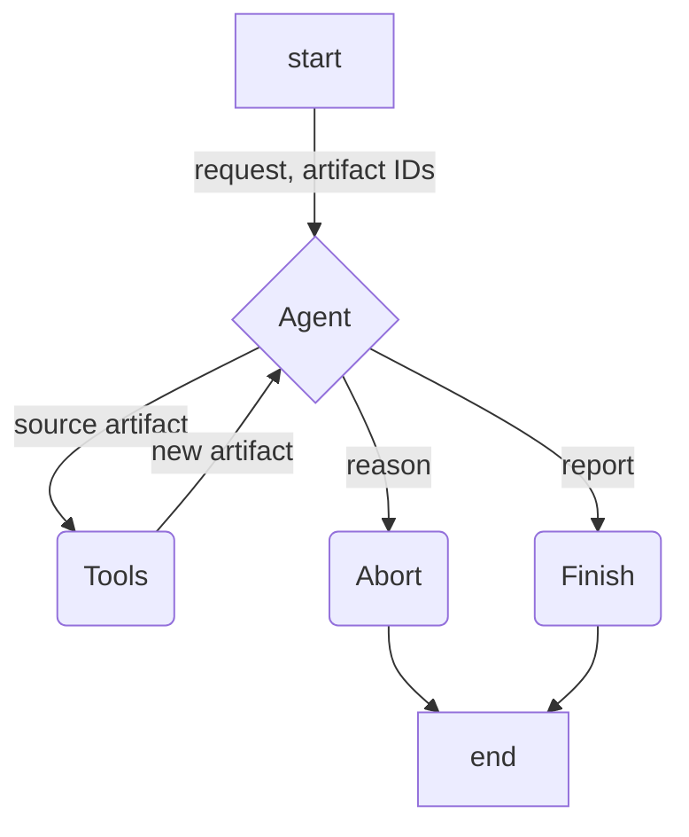

# ichatbio-data-handler-agent

Transforms existing data artifacts into new artifacts. Uses LangChain to run a reason-then-act (ReAct) agent.



Tools include:

- Run a JQ query

## Quickstart

*Requires python 3.10 or higher*

Set up your development environment:

```bash
python3 -m venv .venv
source .venv/bin/activate
pip install .
```

Run the server:

```bash
uvicorn --app-dir src agent:create_app --factory --reload
```

You can also run the agent server as a Docker container:

```bash
docker compose up --build
```
